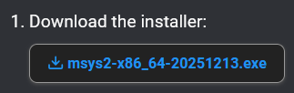
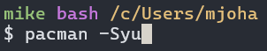
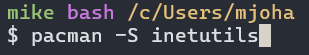
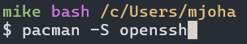
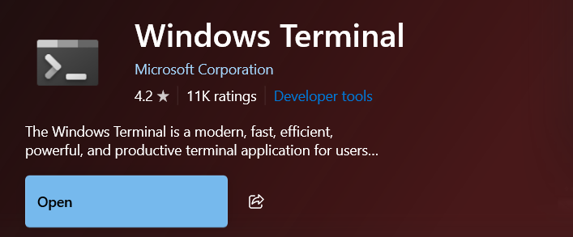

# Step 1: Go to msys2.org and download the installer

    This changes your "Home" to be in C:\msys64\home\username\ when  
    using a bash shell, keep that in mind. You should have the .local folder  
    that contains the scripts for this project in that "Home" not the Windows home.  
    Also be sure that the .bashrc, .bash_profile, and .profile files are there too.

    🟩 Correct: C:\msys64\home\username\.local  <--- MSYS2 Home

    🟥 Incorrect: C:\Users\username\.local  <--- Windows Home

 
 

# Step 2: Use pacman package manager to update packages (Do this twice!)

    ...

 
 

# Step 3: Use pacman to install OpenSSH and telnet (inetutils)

    Update packages again, it probably won't find anything  
    to update which is fine, but it's just to be sure.

 
 

# Step 4: Download Windows Terminal from the Microsoft Store

 
 

# Step 5: Download Pymanager from the Microsoft Store

    Follow along with instructions after installing, make sure to do the
    "execution alias settings" changes. The "versioned python commands" changes
    aren't necessary, you can skip that part. Install the latest python runtime.

 
 

# Step 6: Ensure that your .bash_profile, .bashrc, and .profile files are correct
    
    They should have the additions that are shown in this project. You can copy them  
    directly, they make important additions to $PATH so that your bash shell can see your  
    Windows Python installation. If you want to change the prompt of the shell  
    (since it has my name) you can edit it in .bash_profile

 
 

# Step 7: Replace Windows Terminal settings.json with the one in this repo

    This is optional, it includes keybinding changes so that it can mimic  
    "application keypad mode" where the keypad will send escape sequences  
    instead of the actual number on the keypad. This is very useful for editors  
    on OpenVMS. If you do skip this part, just make sure the CommandLine for the  
    Windows Terminal profile you make to launch the MSYS2 bash shell looks  
    something like this:

    C:\msys64\msys2_shell.cmd -defterm -here -no-start -ucrt64

 
 

# 🎉 Finished! 🎉

    You should be able to type vmsmenu at the shell prompt to use the session manager  
    to connect to your saved hosts. You can also type addhost to use an interactive menu  
    to save sessions into the config files so that vmsmenu can use them.